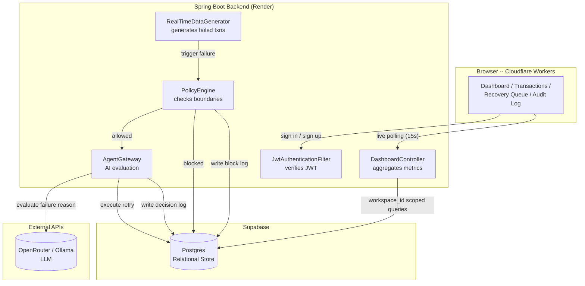

<div align="center">
<br/>

**Autonomous AI Payment Recovery Agent for Razorpay**

[](https://github.com/mdharishsuhaib/Zoqel/stargazers) [](https://github.com/mdharishsuhaib/Zoqel/network/members)

[](https://spring.io/projects/spring-boot) [](https://react.dev/) [](https://supabase.com/) [](https://render.com/)

</div>

---

## Hackathon Submission

Built for the **Razorpay Buildathon** -- an autonomous merchant-facing agent that
answers the billion-dollar e-commerce question: *"How do we intelligently recover failed
payments without alienating customers or burning engineering time on static retry loops?"*

Instead of a merchant relying on rigid, hardcoded cron jobs to retry failed payments,
**Zoqel** acts as an autonomous financial agent. It intercepts failed transactions in
real-time, evaluates the exact failure reason, cross-references the merchant's custom
risk boundaries (e.g., maximum retry amounts, required confidence thresholds), and
autonomously executes a recovery strategy.

---

## Table of Contents

- [Overview](#overview)
- [Key Features](#key-features)
- [System Architecture](#system-architecture)
- [Repository Structure](#repository-structure)
- [Prerequisites](#prerequisites)
- [Quick Start](#quick-start)
- [Backend Setup](#backend-setup)
- [Frontend Setup](#frontend-setup)
- [Autonomous Recovery Pipeline Reference](#autonomous-recovery-pipeline-reference)
- [AI Agent Policy Reference](#ai-agent-policy-reference)
- [API Reference](#api-reference)
- [Simulator Engine](#simulator-engine)
- [Database Schema](#database-schema)
- [Credential Handling & Security Model](#credential-handling--security-model)
- [Operational Limits and Constraints](#operational-limits-and-constraints)
- [Deployment](#deployment)
- [Running Tests](#running-tests)
- [Troubleshooting](#troubleshooting)
- [Tech Stack](#tech-stack)

---

## Overview

Zoqel is an AI-powered control center that sits between a merchant's payment gateway and
their customer base. 

Pipeline, end to end:

1. Merchant signs in (JWT authentication) and completes the onboarding wizard to create
   their strictly isolated workspace.
2. They configure their AI Agent boundaries (`max_retries`, `max_auto_amount`,
   `require_human_for_high_risk`).
3. A deterministic background simulator generates live, realistic failed transactions
   across different customers and failure reasons.
4. The moment a transaction fails, Zoqel's AI intercepts it. It evaluates the risk and
   the failure reason (e.g., Insufficient Funds vs. Network Error).
5. If the recovery confidence exceeds the merchant's threshold, the agent executes the
   retry. If it falls below the threshold or hits a hard limit, it escalates the case to
   a human.
6. The merchant watches a live-polling dashboard (15s intervals) that tracks Revenue at
   Risk, Recoverable Revenue, and an active queue of the AI's operations -- backed by an
   immutable audit log.

---

## Key Features

- **Autonomous Policy Engine** -- Merchants define exact boundaries (`max_auto_amount`,
  `min_recovery_confidence`). The agent operates autonomously *only* within these
  boundaries, escalating anything outside them to a human.
- **Deterministic Live Simulator** -- No empty dashboards. A background engine
  continuously generates realistic Razorpay transaction data across multiple customers,
  allowing users to see the AI agent react in real-time.
- **Resilient Real-Time Dashboard** -- A live-polling dashboard (15s intervals) that
  gracefully handles backend cold-starts with beautiful "Server waking up" and
  "Reconnecting" UI states instead of breaking or showing fabricated data.
- **Strict Multi-Tenancy (Workspace Isolation)** -- Built from the ground up for SaaS.
  Every transaction, customer, recovery case, and policy rule is strictly scoped to a
  specific `workspace_id`. User A can *never* see User B's recovery queues.
- **Immutable Audit Trail** -- The AI agent's reasoning isn't a black box. Every
  decision, retry, escalation, and policy block is recorded in an immutable audit event
  log so merchants can see exactly *why* the AI took action.
- **Bulletproof Session Handling** -- Demo accounts and real authenticated accounts are
  strictly segregated. Visiting a demo route will never silently hijack or destroy a real
  merchant's active session.

---

## System Architecture



- **Frontend** -- React 18 + Vite + Tailwind CSS. Hosted on Cloudflare Workers for zero
  latency. Handles JWT session management, multi-step onboarding, and background
  live-polling.
- **Backend** -- A stateless Java Spring Boot 3 API. Handles the heavy lifting: the
  deterministic simulator, the AI evaluation logic, transaction routing, and metric
  aggregation. Fully dockerized and memory-optimized (`-Xmx256m`) for 512MB free-tier
  constraints.
- **Database** -- Supabase Postgres. Row-level security is enforced at the application
  level via `CurrentUserService`, which automatically injects the authenticated user's
  `workspace_id` into every single database query.
- **Stateless & Idempotent** -- Built to survive network drops. Workspace creation is
  idempotent, and API errors naturally propagate to the frontend to trigger retry UI
  flows rather than silently failing.

---

## Repository Structure

```text
zoqel/
├── backend/
│   ├── src/main/java/com/zoqel/
│   │   ├── agent/           # AI Gateway, LLM decision models, actions
│   │   ├── audit/           # Immutable event logging engine
│   │   ├── auth/            # JWT validation, Demo route guards
│   │   ├── dashboard/       # Aggregation queries for UI metrics & charts
│   │   ├── policy/          # Merchant-defined rules & constraints
│   │   ├── recovery/        # Recovery Case management (Pending/Resolved/Escalated)
│   │   ├── risk/            # Pre-LLM risk evaluation heuristics
│   │   ├── simulator/       # Deterministic background Razorpay simulator
│   │   ├── transaction/     # Core payment processing entities
│   │   └── workspace/       # Multi-tenant isolation context
│   ├── src/main/resources/
│   │   ├── db/migration/    # Flyway SQL schemas for Supabase
│   │   └── application.yml  # Spring Boot configuration
│   ├── Dockerfile           # Optimized multi-stage build (-Xmx256m -Xss512k)
│   └── pom.xml
└── frontend/
    ├── src/
    │   ├── app/             # React app shell & routing
    │   ├── components/      # UI primitives, charts, metrics, skeletons
    │   ├── features/        # Domain modules (overview, onboarding, auth)
    │   ├── services/        # API client bindings (axios)
    │   └── stores/          # Zustand state management
    ├── package.json
    └── vite.config.ts
```

---

## Prerequisites

- Node.js 18+ and `npm` for the frontend.
- Java 21+ and `maven` for the backend.
- A [Supabase](https://supabase.com/) project (free tier is enough) -- for Postgres.
- A long random string to use as your `JWT_SECRET`.

---

## Quick Start

Two processes, two terminals.

```bash
# Terminal 1 -- backend
cd backend
export DB_URL=jdbc:postgresql://<SUPABASE_HOST>:5432/postgres?sslmode=require
export DB_USER=postgres.<your-project>
export DB_PASSWORD=<your-password>
export JWT_SECRET=<your-secret>
mvn spring-boot:run
```

```bash
# Terminal 2 -- frontend
cd frontend
npm install
npm run dev
```

Open:

- Frontend: `http://localhost:5173`
- Backend health check: `http://localhost:8080/actuator/health`

Before either will fully work, the Spring Boot application will automatically run Flyway
migrations to create all required tables in your Supabase database on startup.

---

## Backend Setup

```bash
cd backend
```

Set your environment variables (can be done inline or placed in your OS environment):

```bash
DB_URL=jdbc:postgresql://<SUPABASE_HOST>:5432/postgres?sslmode=require
DB_USER=postgres.<your-project>
DB_PASSWORD=<your-password>
JWT_SECRET=super_secret_key
PORT=8080
FRONTEND_URL=http://localhost:5173
```

Run the application:

```bash
mvn clean spring-boot:run
```

The backend is now live on port `8080`.

---

## Frontend Setup

```bash
cd frontend
npm install
npm run dev
```

Create a `.env` file at the `frontend/` root if you need to point to a deployed backend:

```text
VITE_API_BASE_URL=http://localhost:8080/api
```

---

## Autonomous Recovery Pipeline Reference

The autonomous pipeline is triggered immediately when the `RealTimeDataGenerator`
simulator creates a failed transaction.

1. **Simulate & Trigger** (`TransactionService.simulate`) -- A realistic transaction
   fails. An `Audit Event` is instantly recorded.
2. **Risk Detection** (`RiskDetectionService`) -- Evaluates the customer's history. Has
   this customer failed payments before? Is the amount unusually high? Assigns a Risk
   Score (0-100) and a Risk Tier.
3. **Policy Engine Check** (`PolicyEngine`) -- Before the AI can act, the engine checks
   the merchant's hard boundaries for that specific `workspace_id`.
   - *Is the amount too high?* -> **BLOCKED**
   - *Have we retried too many times?* -> **BLOCKED**
4. **AI Gateway** (`AgentGateway`) -- If the policy allows it, the transaction details
   are sent to the AI Agent. The agent returns a `RecoveryAction` (RETRY, ESCALATE,
   IGNORE) along with an explanation.
5. **Execution** -- If the AI says RETRY, a new `PaymentAttempt` is logged. If it
   succeeds, the transaction is marked `RECOVERED`.

---

## AI Agent Policy Reference

The agent is constrained by strict rules stored in the `policy_rules` table, configured
by the merchant during onboarding. 

| Policy Key | Enforcement | Consequence |
|---|---|---|
| `max_auto_amount_paise` | Hard Limit | If transaction amount > limit, AI is blocked; case escalates. |
| `max_retries_per_transaction` | Hard Limit | If attempt count > limit, AI is blocked; case escalates. |
| `min_recovery_confidence` | Soft Guardrail | If AI calculates success probability < limit, it will not retry. |
| `require_human_for_high_risk` | Override | If Risk Score > 80, autonomous action is disabled. |

Every time a policy blocks an action, it is written to the immutable `audit_events`
table so the merchant sees exactly *why* the AI didn't touch a high-value failed payment.

---

## API Reference

Base URL: `http://localhost:8080` (local) -- all `/api/*` endpoints require
`Authorization: Bearer <jwt_token>`.

### `GET /actuator/health`

Plain liveness check for deployment platforms.

```json
{ "status": "UP" }
```

### `GET /api/dashboard/metrics`

Aggregates live statistics for the authenticated user's workspace.

Returns: `DashboardMetrics` (Total analyzed, Revenue at risk, Recovery rate, Blocked actions).

### `GET /api/dashboard/chart`

Returns an array of the last 30 days of transaction volume mapped into At-Risk,
Recoverable, and Recovered buckets for chart rendering.

### `POST /api/transactions/simulate`

```json
{
  "customerId": "uuid",
  "amountPaise": 50000,
  "failureReason": "INSUFFICIENT_FUNDS",
  "paymentMethod": "UPI"
}
```

Triggers the creation of a failed transaction for the current workspace. Automatically
fires the Risk Detection and Policy Engine.

---

## Simulator Engine

Because an AI Payment Recovery agent is impossible to demo without live failures, Zoqel
includes a deterministic `RealTimeDataGenerator` that runs every 10 seconds.

- It isolates simulation state per `workspace_id`.
- It generates realistic customers with behavioral patterns (e.g. "frequent failer").
- It intentionally fails transactions with diverse reasons (`INSUFFICIENT_FUNDS`,
  `NETWORK_ERROR`) to trigger different AI logic paths.

---

## Database Schema

Supabase Postgres is used as the relational store. All queries in the Spring Boot backend
automatically append `WHERE workspace_id = ?` using the `CurrentUserService` to enforce
tenant isolation.

| Table | Purpose |
|---|---|
| `workspaces` | Root tenant object. One workspace per merchant. |
| `app_users` | Users authorized to view/manage a workspace. |
| `transactions` | The core ledger. Tracks amount, status, and failure reason. |
| `customers` | End-users making payments. Contains their historical risk profiles. |
| `recovery_cases` | Created when a transaction fails. Tracks the AI agent's interventions. |
| `policy_rules` | Merchant-defined limits (e.g., max auto amount, max retries). |
| `audit_events` | Immutable chronological log of every system and AI action. |

---

## Credential Handling & Security Model

- **Stateless Authentication:** User sessions are managed via JWT. The backend does not
  store session state in memory. 
- **Demo Isolation:** The `DemoGuardFilter` automatically intercepts any requests made by
  the `demo-workspace`. `GET` requests are permitted to allow dashboard viewing, but
  `POST`/`PUT`/`DELETE` requests are strictly blocked at the filter level to prevent demo
  users from corrupting shared data.
- **Data Scoping:** Every single entity is strictly bound to a `workspace_id`. The
  `CurrentUserService` injects the authenticated user's workspace ID into every database
  query, making cross-tenant data leaks impossible at the application layer.

---

## Operational Limits and Constraints

| Constraint | Value | Where |
|---|---|---|
| Simulator Frequency | 10 seconds / workspace | `RealTimeDataGenerator.java` |
| Dashboard Polling | 15 seconds | `OverviewPage.tsx` |
| Max Auto Amount | Configurable (Default: 10,000 INR) | `application.yml` |
| Min AI Confidence | Configurable (Default: 0.75) | `application.yml` |

---

## Deployment

**Backend → Render** (Java Web Service):

- Root directory: `backend`
- Environment: `Docker` (Render detects the multi-stage `Dockerfile`)
- Environment variables: `DB_URL`, `DB_USER`, `DB_PASSWORD`, `FRONTEND_URL`,
  `JWT_SECRET`. Render sets `PORT` itself.

**Frontend → Cloudflare Workers**:

- Environment variables: `VITE_API_BASE_URL` (your Render backend URL).

Database migrations (Flyway) are executed automatically by the Spring Boot application on
startup against Supabase.

---

## Running Tests

Backend tests are written using JUnit 5 and Spring Boot Test:

```bash
cd backend
mvn test
```

---

## Troubleshooting

### CORS error in the browser console

`Access-Control-Allow-Origin` header missing — The `FRONTEND_URL` environment variable on
the backend either isn't set or doesn't exactly match the frontend's origin. Ensure there
is **no trailing slash** (e.g., `http://localhost:5173`).

### "Server is waking up" / Reconnecting UI remains stuck

If you are on Render's free tier, the backend spins down after 15 minutes of inactivity.
When you open the frontend, the first request will take 60–90 seconds while Render boots
the Docker container. The UI is designed to handle this gracefully. Wait 90 seconds.

### Data is missing / 404 errors on startup

Check the backend logs to ensure Flyway successfully migrated the Supabase database.

---

## Tech Stack

React 18 · TypeScript · Tailwind CSS · Vite · Zustand · Java 21 · Spring Boot 3 ·
Spring Security · Supabase (PostgreSQL) · Flyway · Docker · Render · Cloudflare Workers
